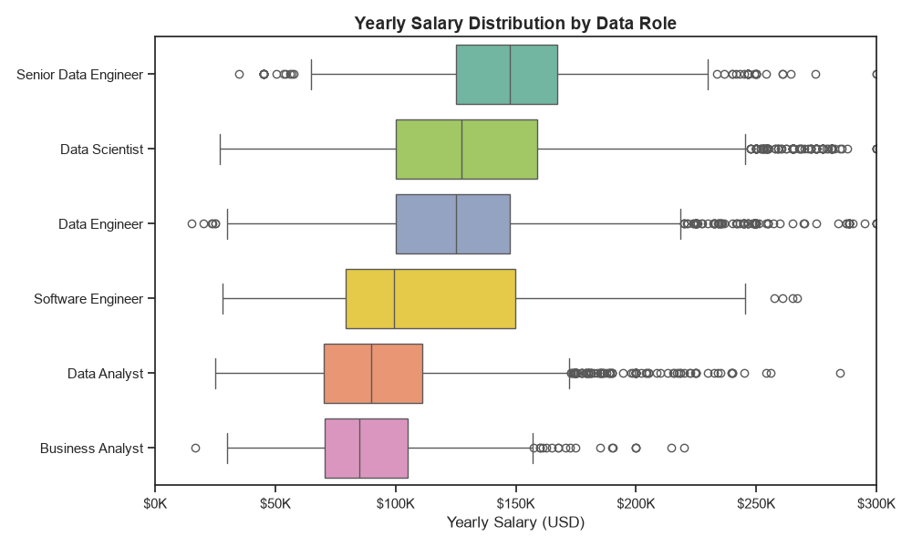
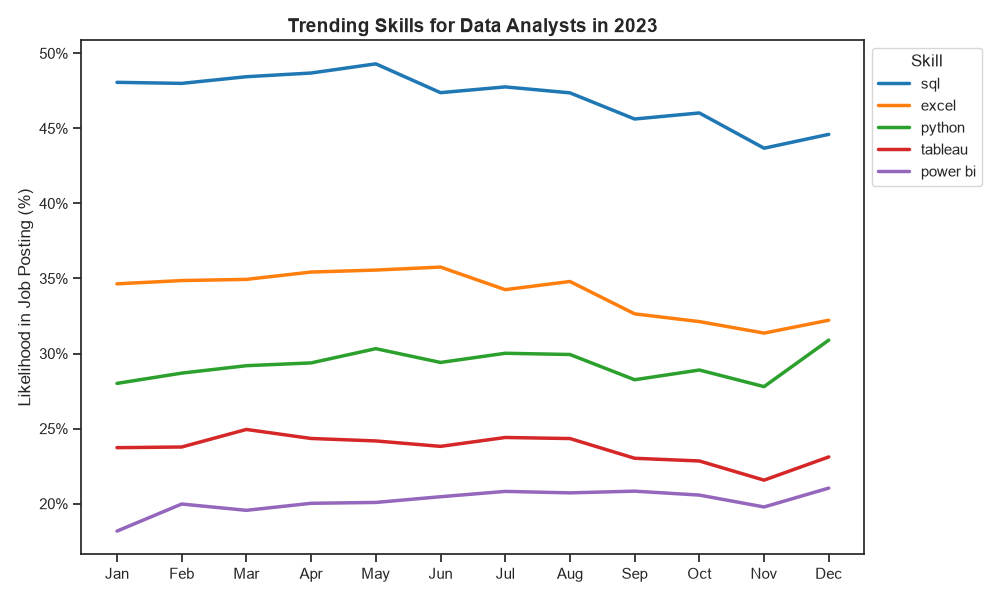
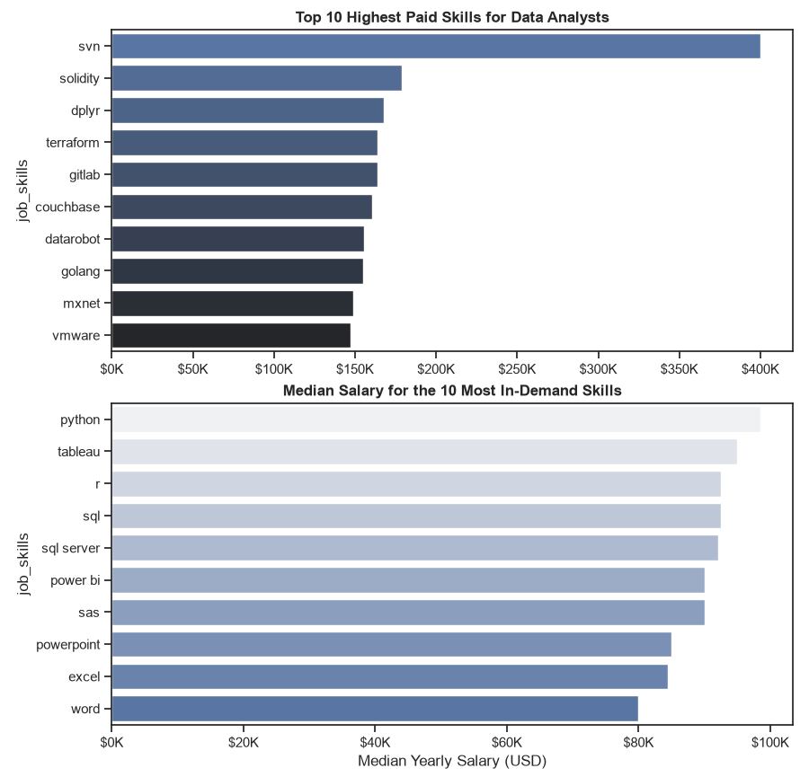
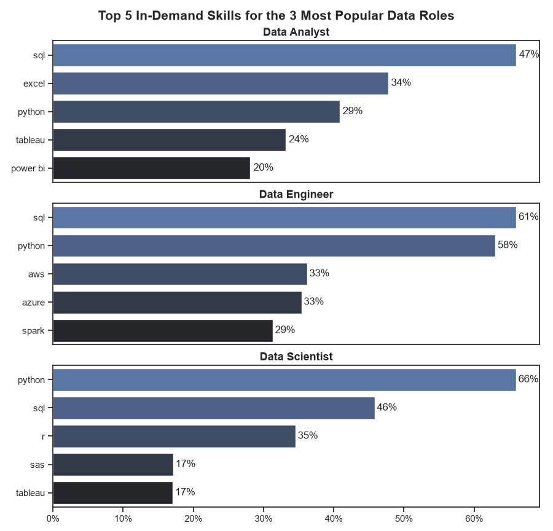

# Data Jobs Market Analysis

A small analysis project that answers four questions about the data-job market:

1. What are the skills most in demand for the top 3 most popular data roles?
2. How are in-demand skills trending for Data Analysts?
3. How well do jobs and skills pay for Data Analysts?
4. What are the optimal skills for Data Analysts to learn (high demand **and** high pay)?

## Data

The project uses the public **`lukebarousse/data_jobs`** dataset on Hugging Face —
about 785,000 real data-related job postings (job title, location, posting date,
salary where available, and required skills). The code loads it straight from its
CSV file (`pandas.read_csv()` on a Hugging Face URL) the first time you run it
(requires an internet connection; the file is about 231 MB, so it can take a
minute). No `datasets`/`pyarrow` install needed — just pandas, numpy, matplotlib,
and seaborn.

## Files

| File | Use it in |
|---|---|
| `data_jobs_analysis_thonny.py` | **Thonny** (or any plain Python interpreter) — run top to bottom |
| `data_jobs_analysis_notebook.ipynb` | **Jupyter** — run cell by cell |
| `requirements.txt` | Package list for both |

Both files contain the *exact same analysis*, just packaged differently: the
`.py` file shows every chart with `plt.show()` in sequence (works well in
Thonny, which doesn't render charts inline the way Jupyter does), while the
notebook splits things into labeled cells with markdown explanations.

## Setup

1. Install Python 3.9+ if you don't have it.
2. Install the required packages:

   ```bash
   pip install -r requirements.txt
   ```

   (In Thonny: **Tools → Manage Packages**, and install `pandas`, `numpy`,
   `matplotlib`, `seaborn` one by one, or open Thonny's built-in terminal —
   **Tools → Open System Shell** — and run the pip command above.)

   If a package still fails with a `Failed building wheel for ...` error,
   it usually means pip is trying to compile it from source instead of using
   a prebuilt wheel. Try:
   - `python -m pip install --upgrade pip` first, then reinstall — old pip
     versions often can't find prebuilt wheels for your Python version.
   - Check **Tools → Options → Interpreter** in Thonny to see which Python
     version it's using; a brand-new Python release sometimes doesn't have
     wheels yet for every package.
   - As a last resort, install packages one at a time so you can see exactly
     which one is failing.

### Running in Thonny

1. Open `data_jobs_analysis_thonny.py` in Thonny.
2. Press **Run** (F5). The first run downloads the dataset (a few hundred MB),
   so it may take a minute or two — subsequent runs use the local cache.
3. Charts will pop up in separate windows one at a time; close each one to
   move to the next section of the analysis.

### Running in Jupyter

1. Launch Jupyter: `jupyter notebook` or `jupyter lab`
2. Open `data_jobs_analysis_notebook.ipynb`
3. Run all cells (**Cell → Run All**, or step through with Shift+Enter).
   Charts render inline below each cell.

## Results: where to find your charts, and how to plot them

Both versions of the project produce the same **5 charts**, one for each
part of the analysis:

| File name | Answers |
|---|---|
| `q1_skills_for_top3_roles.png` | Question 1 — top 5 skills for each of the 3 most popular data roles |
| `q2_trending_skills_data_analyst.png` | Question 2 — how the top 5 Data Analyst skills trended month-by-month in 2023 |
| `q3a_salary_by_role.png` | Question 3 — salary distribution across the top 6 data roles |
| `q3b_da_skill_pay.png` | Question 3 — highest-paid skills vs. pay for the most in-demand skills (Data Analyst) |
| `q4_optimal_skills.png` | Question 4 — the "high demand AND high pay" scatter plot |






**Both scripts save every chart automatically** into a `results/` folder
created next to the file you ran, in addition to displaying it:

- **Thonny**: charts pop up in separate windows *and* are saved to
  `results/` (a subfolder next to `data_jobs_analysis_thonny.py`). You'll
  see a line like `Saved chart -> .../results/q1_skills_for_top3_roles.png`
  printed in the Shell as each chart is produced. Close each pop-up window
  to move on to the next section of the script.
- **Jupyter**: charts render inline below each cell *and* are saved to
  `results/` (a subfolder next to wherever you launched Jupyter /
  wherever the notebook file lives, i.e. `os.getcwd()`). The same
  `Saved chart -> ...` message prints as the output of each plotting cell.

You don't need to do anything extra to get the images — just run the file
top to bottom (or Run All in Jupyter) and check the `results/` folder
afterwards.

### Re-plotting without re-running everything

Since each Python variable used in a chart (`skill_stats`, `df_da`,
`skills_pct_by_month`, etc.) stays in memory after the script/notebook
finishes, you can tweak just the plotting code and re-run only that
section instead of the whole file:

- **In Thonny**: use the **Shell** at the bottom to re-run individual
  lines/blocks after the full script has executed once — the variables are
  still available in that session. Or copy just the plotting block you
  want into the Shell and adjust it (colors, `figsize`, number of skills
  shown, etc.) before calling `save_fig("my_new_name.png")` again.
- **In Jupyter**: just edit a single plotting cell (e.g. change
  `.head(5)` to `.head(10)` in Question 1, or `palette="Set2"` to a
  different seaborn palette) and re-run that one cell with Shift+Enter —
  no need to reload the data or re-run earlier cells.

### Changing where images are saved

Each file defines `RESULTS_DIR` near the top (right after the imports).
Change that line if you'd rather save charts somewhere else, e.g.:

```python
RESULTS_DIR = "/path/to/directory"
```

## Notes / things you can tweak

- **Country filter**: by default the analysis uses all postings globally.
  There's a commented-out line in Question 2 you can uncomment to filter to
  `job_country == "United States"` (or any other country) if you want a more
  local picture.
- **Minimum demand threshold** in Question 4 (`demand_pct >= 5`) filters out
  rare/noisy skills before ranking pay — lower it to see more (noisier) skills,
  raise it to see only the most common ones.
- Salary figures (`salary_year_avg`) are only present for a subset of postings
  that listed a salary, so Question 3/4 use that subset only — this is normal
  and expected, not a bug.
