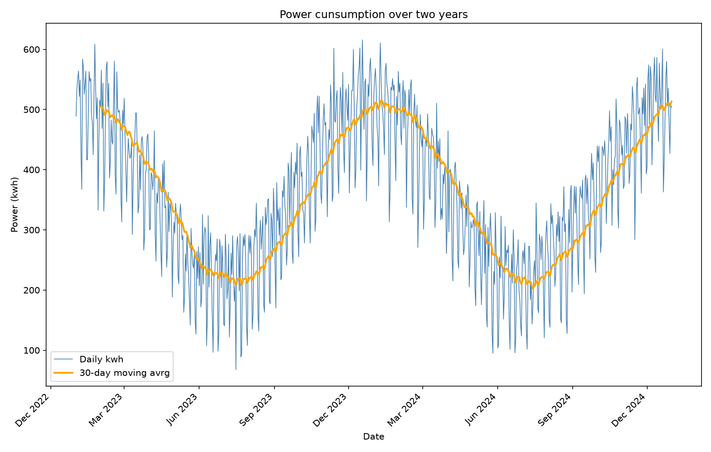

# Pandas Time Series: Dates, Resampling & Rolling Averages

## The goal of this project

Dates are one of the trickiest data types to work with in practice.
A "date" column read in from a file often isn't actually stored as a
date at all — it's just text that *looks* like one — and even once
it's properly converted, there's a whole toolkit of pandas-specific
tricks for working with it: pulling out the weekday, selecting a
whole month with a single string, changing the frequency of the data
(daily → monthly), and smoothing out noisy day-to-day swings to see
the underlying trend.

This project works through that toolkit using two examples:

1. **Building a year of daily sales** — starting from a proper
   `date` column and showing what a well-formed time series looks
   like from the outset.
2. **Two years of factory electricity readings** — starting instead
   from dates stored as plain text, and walking through the full
   process of turning that into a usable, indexed time series: type
   conversion, weekday analysis, date-range selection, resampling to
   monthly/quarterly totals, a rolling 30-day average, and a
   month-over-month percentage-change report.

The second example is the more realistic one — most exported data
really does show up with dates as text — so most of the interesting
work, and all of the plotting, happens there.

## Tools & libraries used

- **pandas** — does essentially everything here: `pd.date_range()` to
  build a date sequence, `pd.to_datetime()` to convert text into real
  dates, the `.dt` accessor to pull out weekday/month/day-of-year,
  `.set_index()` to make the date the DataFrame's index, partial-string
  date selection (`power.loc['2024-07']`), `.resample()` to change
  frequency, `.rolling()` for a moving average, and `.shift()` /
  `.pct_change()` for the month-over-month report.
- **NumPy** — builds the synthetic trend/seasonal/noise components
  (`np.linspace`, `np.cos`, `np.where`, `np.random.normal`) that make
  the two example datasets look like believable real-world data
  instead of a flat line.
- **Matplotlib** — plots the two-year power consumption series
  against its 30-day moving average.
- **os** (standard library) — creates the `images/` output folder
  automatically if it doesn't already exist, so the plot has
  somewhere to save to on a fresh machine.

## What the script does, step by step

**Example 1 — daily sales:**
Builds a full year of daily dates with `pd.date_range()`, then
constructs a synthetic `revenue` column out of an upward trend, a
weekend bump, a December rush, and random noise — a quick way to get
a realistic-looking series to experiment on, and a template for
building test data in general.

**Example 2 — factory power readings:**

1. **Convert text to real dates.** `reading_date` starts out as plain
   text (`str` dtype) on purpose. `pd.to_datetime()` converts it, and
   `.set_index()` makes it the DataFrame's index (`power`), which is
   what unlocks all the date-aware selection and resampling used
   afterward.
2. **Pull out the weekday.** `power.index.day_name()` adds a weekday
   column, then `groupby('weekday').mean()` gives the average kWh per
   day of the week — reordered Monday → Sunday, since grouping by name
   alone sorts alphabetically rather than calendar order.
3. **Select date ranges with plain strings.** `power.loc['2024-07']`
   selects an entire month; `power.loc['2023-11':'2024-01']` selects a
   range spanning a year boundary — no need to build explicit
   `datetime` objects for either.
4. **Resample to a different frequency.** `.resample('MS')` collapses
   the daily data down to monthly totals; `.resample('QS')` collapses
   it to quarterly averages.
5. **Smooth the series with a rolling average.** `.rolling(30).mean()`
   adds a `ma_30` column — the 30-day moving average — plotted
   alongside the raw daily series.
6. **Track month-over-month change.** `.shift(1)` lines up each
   month's total against the previous month's, and `.pct_change()`
   turns that into a percentage swing, making it easy to spot the
   single worst month with `.idxmin()`.

## How to add automatic plot-saving to a script

By default, `plt.show()` only *displays* a plot — it doesn't save
anything to disk, and the figure is gone once you close the window.
To have a script save every plot automatically, add two things:

```python
import os

os.makedirs('images', exist_ok=True)   # 1. make sure the output folder exists
```

then, right after `plt.tight_layout()` and **before** `plt.show()`:

```python
plt.savefig('images/power_consumption.png', dpi=150)  # 2. save the figure
plt.show()
```

The order matters: `plt.savefig()` has to come *before* `plt.show()`,
because on some systems `plt.show()` clears the figure from memory
once the window closes, and anything after that would save a blank
image. `dpi=150` controls the resolution of the saved file — higher
numbers give a sharper (and larger) image file.

This exact pattern is already wired into `time_series.py` in this
project — every time you run the script, it regenerates
`images/power_consumption.png` automatically, no manual export step
needed.

## Results

Running the script prints a full walkthrough to the console and
produces one plot. The highlights:

- **Average kWh per weekday** — a clear weekday/weekend split, with
  weekends noticeably lower:

  | Weekday   | Avg. kWh |
  |-----------|:--------:|
  | Monday    | 398.69   |
  | Tuesday   | 400.19   |
  | Wednesday | 399.27   |
  | Thursday  | 400.06   |
  | Friday    | 396.95   |
  | Saturday  | 275.34   |
  | Sunday    | 277.16   |

- **Partial-string date selection:** July 2024 totalled **7,154.10
  kWh**; the 2023-11 to 2024-01 winter window totalled **45,146.70
  kWh**.
- **Monthly and quarterly resampling** confirm the seasonal pattern:
  usage is highest in winter months (e.g. January 2023 at 15,639.1
  kWh total) and lowest in the summer (e.g. Q2/Q3 quarterly averages
  around 265–275 kWh vs. ~455–462 kWh in Q1/Q4).
- **Biggest month-over-month fall:** **April 2023**, at **-22.54%**
  versus March — the sharpest single drop in the whole two-year
  report.
- **The plot** shows the raw daily readings (thin blue) against the
  30-day moving average (thick orange), making the underlying winter
  high / summer low seasonal cycle clearly visible underneath the
  day-to-day noise:

  

## How to run it

```bash
pip install -r requirements.txt
python time_series.py
```

The script prints its output at every step and regenerates
`images/power_consumption.png` automatically on each run.

## Project structure

```
.
├── time_series.py           # main script (both examples)
├── requirements.txt         # dependencies
├── images/
│   └── power_consumption.png
└── README.md                 # this file
```
