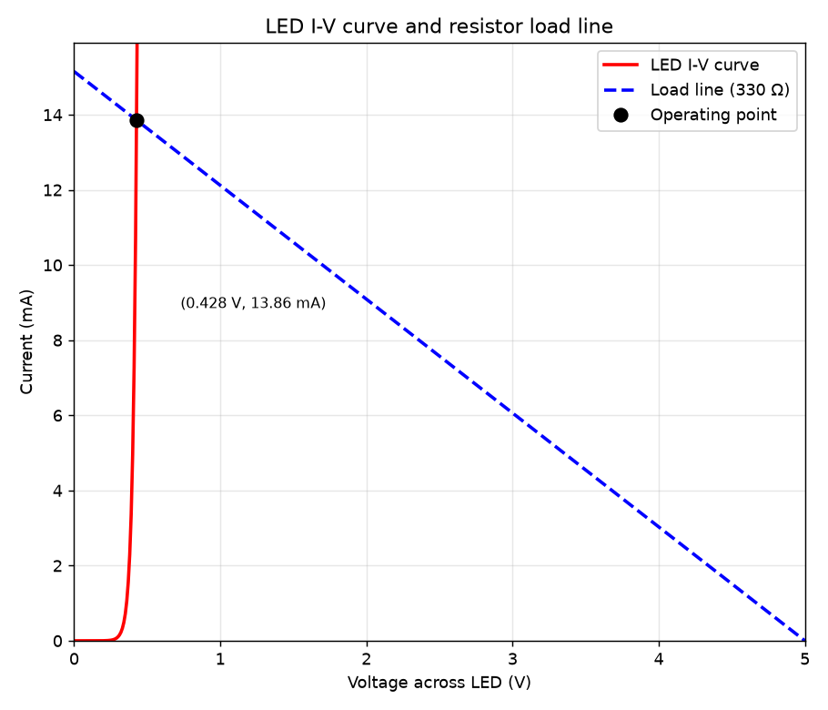
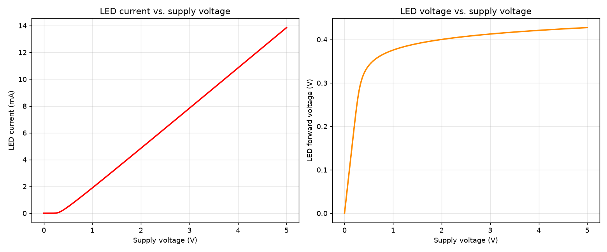

# LED Circuit Model — DC Operating Point & I-V Analysis

## What this is

This project simulates a very common small circuit: a **5 V supply**
driving an **LED** in series with a **330 Ω current-limiting
resistor**, referenced to ground. It's the kind of circuit you'd build
to light a single LED from a benchtop power supply or a microcontroller
pin, and the resistor's whole job is to keep the LED's current inside
a safe range instead of letting it draw as much as the supply would
otherwise allow.

The circuit:

```
     +-------[ LED ]-------+
     |                      |
    (V)                   [ R ]
     |                      |
     +----------+-----------+
                |
               ---  ground
```

The goal of the project is to find the circuit's **DC operating
point** — the actual voltage across the LED and the actual current
flowing through it once everything settles — and to show *why* that
particular point is where it is, using the classic **load-line**
method from circuit theory.

## The LED model

An LED is a diode, and diodes are the textbook example of a
**nonlinear** circuit element: the current through them isn't
proportional to the voltage across them (as it would be for a
resistor), it grows *exponentially*. This project uses the standard
exponential diode equation (the Shockley diode law), with a parallel
leakage-resistance term added, exactly as most circuit simulators
model a plain diode:

```
I_diode = Ids * (exp(V_diode / Vt) - 1) + V_diode / R_parallel
```

- **`Ids`** (reverse saturation current) — a very small current, here
  `1e-9 A`, that flows even when the diode is barely turned on. It
  sets how sharply the exponential "turns on."
- **`Vt`** (thermal/fit voltage) — here `0.026 V`, the textbook thermal
  voltage `kT/q` at room temperature. It controls how steep the
  turn-on curve is.
- **`R_parallel`** — a very large (`1e8 Ω`) parallel resistance
  representing a tiny leakage path. It's negligible at any forward
  voltage this circuit reaches, and is only included for completeness
  — real diode models almost always have it.

This is a simplified, generic diode equation rather than a full LED
model (real LEDs also involve the semiconductor bandgap, which
usually pushes the real turn-on voltage up to somewhere around
1.8–3.3 V depending on colour). With `Vt = 0.026 V` as given, this
model turns on much lower — around 0.4 V — which is worth keeping in
mind when comparing these numbers to a real LED datasheet.

### Solving the circuit

Kirchhoff's voltage law around the loop gives one equation:

```
V_supply = V_diode + I_diode * R_resistor
```

Substituting the diode equation in for `I_diode` produces a nonlinear
equation in a single unknown (`V_diode`) — there's no way to isolate
`V_diode` algebraically because it appears both inside and outside an
exponential. This is solved numerically with **bisection**
(`scipy.optimize.brentq`), searching between 0 V and the supply
voltage for the value of `V_diode` that makes both sides of the
equation agree.

## Tools & libraries used

- **NumPy** — array math for the voltage sweeps.
- **SciPy** (`scipy.optimize.brentq`) — solves the nonlinear circuit
  equation for the diode voltage at the operating point.
- **Matplotlib** — all of the result plots (I-V curve, load line,
  voltage/current sweeps).
- **schemdraw** — draws the circuit schematic itself as a clean,
  labelled diagram, purely in Python.

## Files

```
led_project/
├── led_model.py         # physics only: diode equation, circuit solver, sweeps
├── circuit_diagram.py    # draws and saves the circuit schematic
├── simulate_led.py       # main script: solves the circuit, prints + plots results
├── requirements.txt
├── images/                # generated schematic and result plots
└── README.md
```

`led_model.py` has no plotting or drawing code in it — it just solves
equations — so it can be imported and reused in a notebook or another
script without pulling in matplotlib or schemdraw at all.

## Results

### Circuit schematic

Generated directly from the circuit parameters (`circuit_diagram.py`),
so the labels always match whatever values are set in `led_model.py`:


### Operating point

Solving the circuit at the default 5 V supply gives:

| Quantity                | Value       |
|--------------------------|:-----------:|
| Supply voltage            | 5.000 V     |
| LED forward voltage       | 0.4275 V    |
| LED forward current       | 13.856 mA   |
| Resistor voltage          | 4.5725 V    |
| Resistor current          | 13.856 mA   |
| LED power dissipation     | 5.924 mW    |
| Resistor power            | 63.355 mW   |

As expected for a series loop, the LED and resistor carry the same
current, and their two voltages add up to exactly the 5 V supply.

### I-V curve and load line

This is the standard way to *see* why the operating point lands where
it does: the LED's own exponential I-V curve (red) and the resistor's
load line (blue, dashed) — the straight line of every (voltage,
current) pair the resistor and supply would allow. The circuit can
only settle where both are satisfied simultaneously, i.e. where the
two curves cross:



### Supply-voltage sweep

Instead of just the single 5 V case, this sweeps the supply voltage
from 0 to 5 V to show how sharply the LED "turns on": current stays
essentially at zero until the LED voltage crosses roughly 0.3 V, then
rises quickly and settles into an almost straight line — because past
that point, the resistor (a linear element) dominates the circuit's
behaviour far more than the diode's own curve does. The right-hand
plot shows the LED's own voltage levelling off, which is
characteristic of diodes in general: pushing a lot more current
through one only raises its voltage a little:



## Running it in Thonny

1. Open Thonny.
2. Install the dependencies: **Tools → Manage packages...**, then
   search for and install `numpy`, `scipy`, `matplotlib`, and
   `schemdraw`.
3. Open `simulate_led.py` and press **Run** (F5).

This prints the operating-point numbers to the shell and regenerates
both result plots into the `images/` folder. Run `circuit_diagram.py`
on its own if you only want to regenerate the schematic.

## Changing the circuit

All of the circuit values live as named constants at the top of
`led_model.py` (`V_SUPPLY`, `R_RESISTOR`, `VT`, `IDS`, `R_PARALLEL`).
Change any of them and re-run `simulate_led.py` — every number and
every plot updates from those five values, since nothing else in the
project hardcodes them. For example, raising `R_RESISTOR` moves the
load line's intercept down and to the left, which lowers the LED
current; lowering `VT` makes the diode's turn-on curve steeper.
