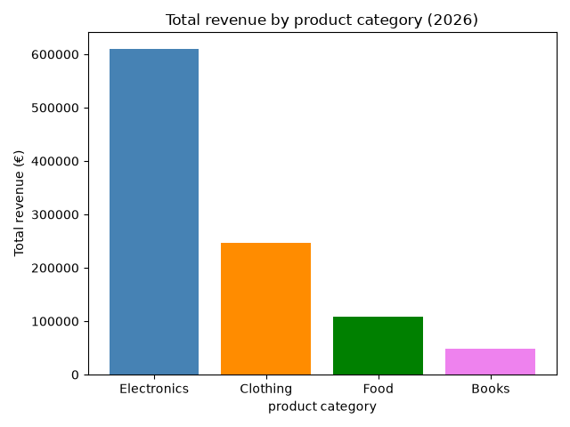

# The Questions

Below are the questions I want to answer in my project:


1. How to write and Read back files such as CSV and inspect it.
2. How to create a column in datasets (e.g. units sold multiplied by price per unit for the retail company).
3. How to Group by product category.
4. How to identify the peak sales month.
5. How to plot results.


# Tools I used in this project:


* Python: The backbone of the analysis, allowing to analyze the data and find critical insights. I also used the following Python libraries: 
* Pandas: Used for analysing  data. Giving me a tool to work with tabular data.
* matplotlib: for visualizing data
* NumPy: A very fast mat library to work with arrays.
* Git & GitHub: Essential for version control and sharing my Python code and analysis, ensuring collaboration and project tracking.
* Jupyter Notebooks: The tool I used to run my Python scripts which let me easily include my notes and analysis.


# Importing libraries: 


Starting by importing necessary libraries and loading the dataset.


```python

import pandas as pd

import numpy as np

import matplotlib.pyplot as plt

```


# Visualizing Data:


```python
fig, ax = plt.subplots(figsize=(8, 5))

ax.bar(category_revenue.index, category_revenue.values, color=['steelblue', '#dd8452', '#55a868', '#c44e52'])

ax.set_xlabel('Product Category')

ax.set_ylabel('Total Revenue (£)')

ax.set_title('Total Revenue by Product Category (2024)')

ax.yaxis.set_major_formatter(plt.FuncFormatter(lambda x, _: f'£{x:,.0f}'))

plt.tight_layout()

plt.show()
```

### Results


*Bar graph visualizing the revenue sales for 4 product categories.*


