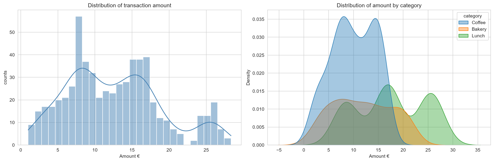

# Café Transactions — Statistical Visualisation with Seaborn

An exploratory data analysis of a year of café transactions, built as a practical tour of
seaborn's plotting API. The dataset is generated synthetically inside the script, so there is
nothing to download and results are fully reproducible via a fixed random seed.



---

## Goals

The project is a hands-on walkthrough of the parts of seaborn you actually reach for when
exploring a DataFrame:

1. **Set a global theme** with `sns.set_theme()` so every chart shares one visual style.
2. **Describe a single distribution** — histogram with an overlaid KDE curve.
3. **Compare distributions across groups** — `kdeplot` with `hue`, filled and semi-transparent.
4. **Count categorical frequencies** — `countplot` with an explicit calendar `order`.
5. **Compare spread across groups** — `boxplot` split by a second variable via `hue`.
6. **Show relationships between two numeric variables** — `scatterplot` encoding two extra
   dimensions through `hue` and `size`, next to a `regplot` linear fit.
7. **Facet a chart into a grid** — `catplot` with `col=`, demonstrating the difference between
   axes-level and figure-level functions.
8. **Reshape and visualise a matrix** — `pivot_table()` rendered as an annotated `heatmap`.
9. **Inspect correlation structure** — correlation matrix as a diverging heatmap centred on zero.

The underlying theme is *how seaborn encodes extra variables*: colour (`hue`), marker area
(`size`), and small multiples (`col` / `row`).

---

## Tools and libraries

| Library | Version | Role in this project |
|---|---|---|
| **Python** | 3.9+ | Language runtime |
| **pandas** | ≥ 2.0 | DataFrame construction, `groupby`, `pivot_table`, `corr` |
| **NumPy** | ≥ 1.24 | Random data generation (`randint`, `choice`, `normal`, `gamma`) and seeding |
| **seaborn** | ≥ 0.13 | All statistical charts |
| **matplotlib** | ≥ 3.7 | Figure/axes scaffolding, `subplots`, `tight_layout`, `savefig` |

Developed in **Thonny**, but the script is a plain `.py` file and runs from any editor or terminal.

### Dataset schema

600 rows, one per transaction, spanning calendar year 2024.

| Column | Type | Description |
|---|---|---|
| `date` | datetime64 | Transaction date |
| `weekday` | object | Day name derived from `date` |
| `category` | object | `Coffee` (50%), `Lunch` (30%), `Bakery` (20%) |
| `items` | int | Items purchased — 1–3 for Lunch, 1–5 otherwise |
| `amount` | float | Spend in €, driven by category base price × items plus noise |
| `queue_minutes` | float | Wait time, drawn from a gamma distribution |
| `member` | object | Loyalty membership, `Yes` (35%) / `No` (65%) |

---

## Running it

```bash
git clone https://github.com/<your-username>/cafe-seaborn-analysis.git
cd cafe-seaborn-analysis

python -m venv .venv
source .venv/bin/activate        # Windows: .venv\Scripts\activate

pip install -r requirements.txt
python cafe_seaborn.py
```

Five PNG files are written to `images/` and each figure is also displayed on screen.

In **Thonny**: open `cafe_seaborn.py` and press **F5**. Thonny needs the file to be saved to
disk before running, because the save path is resolved from `__file__`.

---

## Results

### Spend is driven by basket size, not by queue time

The correlation heatmap is the clearest single summary:

| | items | amount | queue_minutes |
|---|---|---|---|
| **items** | 1.00 | **0.55** | 0.02 |
| **amount** | 0.55 | 1.00 | 0.01 |
| **queue_minutes** | 0.02 | 0.01 | 1.00 |

`items` and `amount` correlate at **0.55** — a moderate positive relationship, visible as the
upward `regplot` trend line. It is not higher because item *price* differs by category: three
coffees and three lunches sit at very different amounts, so item count alone only partly explains
spend.

`queue_minutes` is effectively uncorrelated with everything (0.01–0.02). It was generated
independently, and the heatmap confirms the analysis recovers that — a useful sanity check that
the pipeline is not manufacturing structure.

### Lunch has the highest and widest spend

| Category | Median (€) | Std. dev. (€) |
|---|---|---|
| Bakery | 11.62 | 5.84 |
| Coffee | 10.07 | 4.38 |
| **Lunch** | **17.07** | **6.74** |

**Lunch has the widest spread**, despite being capped at three items — its €8.50 base price means
each extra item moves the total further than in the other categories. Coffee is the tightest
distribution. This shows up in the `kdeplot` as a broad, right-shifted Lunch curve against a
narrow Coffee peak.

### Weekday patterns


Mean spend by weekday and category (€):

| Weekday | Bakery | Coffee | Lunch |
|---|---|---|---|
| Monday | 11.75 | 9.10 | 16.44 |
| Tuesday | 12.47 | 10.02 | 17.80 |
| Wednesday | 11.50 | 10.01 | 17.65 |
| Thursday | 11.59 | 10.12 | 17.39 |
| Friday | 10.96 | 10.89 | 17.35 |
| **Saturday** | **13.97** | 9.37 | **19.07** |
| Sunday | 9.33 | 10.54 | 16.31 |

Saturday is the strongest day for both Bakery (€13.97) and Lunch (€19.07); Sunday is the weakest
for Bakery (€9.33). Transaction *counts*, by contrast, are fairly flat — Tuesday leads at 98 and
Sunday trails at 74. Since the data is random with respect to weekday, these swings are sampling
noise across roughly 74–98 transactions per day, which is itself a worthwhile lesson: an annotated
heatmap will happily render a convincing-looking pattern out of pure noise, so cell-to-cell
differences need a sample-size check before they get interpreted.

---

## Layouts with seaborn

Two layout systems appear in this project, and knowing which one you are in determines how you
customise the chart.

### Axes-level functions

`histplot`, `kdeplot`, `countplot`, `boxplot`, `scatterplot`, `regplot` and `heatmap` all draw
into a single matplotlib `Axes`. They accept `ax=` and return that `Axes`, which lets you compose
a multi-panel figure by hand:

```python
fig, axes = plt.subplots(1, 2, figsize=(15, 5))
sns.histplot(data=cafe, x="amount", kde=True, ax=axes[0])
sns.kdeplot(data=cafe, x="amount", hue="category", ax=axes[1])
fig.tight_layout()
```

Titles and labels are set per-axes with `axes[i].set_title()` and `axes[i].set_xlabel()`.

**`figsize` is `(width, height)`.** For a `1 × 2` grid you want wide and short — `(15, 5)`, not
`(5, 15)`. Getting this backwards squeezes each panel into a narrow column and overlaps the
annotations.

### Figure-level functions

`catplot` (used in step 7) owns the entire figure. It has no `ax=` parameter and returns a
`FacetGrid` rather than an `Axes`, so customisation goes through grid methods:

```python
g = sns.catplot(data=cafe, x="weekday", y="amount",
                kind="bar", col="category",
                order=weekday_order, height=5, aspect=1.1)

g.set_axis_labels("Weekday", "Amount (€)")
g.set_xticklabels(rotation=45)
g.figure.suptitle("Mean spend per weekday by category", y=1.03)
```

Sizing is `height` and `aspect` **per facet**, not `figsize` for the whole figure. The `y=1.03`
on the suptitle lifts it clear of the `category = Coffee` column titles — figure coordinates run
0 (bottom) to 1 (top), so values above 1 sit outside the canvas and need
`savefig(..., bbox_inches="tight")` to avoid being cropped, which the `save()` helper does.

The trade-off in one line: figure-level functions give faceting and a shared external legend for
free, but cannot be placed inside a grid you built yourself.

### Ordering categorical axes

Pandas orders string categories by first appearance, which scrambles weekdays. Both function
families accept `order=` to fix this:

```python
weekday_order = ["Monday", "Tuesday", "Wednesday", "Thursday",
                 "Friday", "Saturday", "Sunday"]

sns.countplot(data=cafe, x="weekday", order=weekday_order)
```

`order` also *filters* — categories omitted from the list are not drawn. For the heatmap, which
takes a pre-shaped matrix rather than long-form data, the equivalent is reordering the DataFrame
before plotting: `grid.reindex(weekday_order)`.

### Heatmap specifics

Row and column labels come from the DataFrame's index and column names, so seaborn labels the
axes automatically — `index="weekday"` becomes the **y**-axis and `columns="category"` the
**x**-axis. Overriding `set_xlabel` with the wrong one is an easy mistake.

For the correlation heatmap, `center=0` with a diverging `coolwarm` palette maps zero to neutral
grey so positive and negative correlations are distinguishable at a glance. Adding `vmin=-1,
vmax=1` pins the colour scale to the full possible range, so the colours mean the same thing
across different datasets.

---

## Saving figures

The script writes every chart to `images/` through a small helper:

```python
from pathlib import Path

IMAGES = Path(__file__).parent / "images"
IMAGES.mkdir(exist_ok=True)

def save(fig, name):
    fig.savefig(IMAGES / f"{name}.png", dpi=150, bbox_inches="tight")
```

Call it with the figure object before `plt.show()`:

```python
fig.tight_layout()
save(fig, "01_distributions")
plt.show()
```

For a figure-level plot, pass the grid's figure: `save(g.figure, "04_facet_weekday_by_category")`.

| Output | Content |
|---|---|
| `images/01_distributions.png` | Histogram + KDE, and KDE by category |
| `images/02_counts_and_spread.png` | Weekday countplot, and boxplot by category and membership |
| `images/03_items_vs_amount.png` | Scatterplot with hue/size, and regplot trend line |
| `images/04_facet_weekday_by_category.png` | Faceted bar chart of mean spend |
| `images/05_heatmaps.png` | Pivot-table heatmap and correlation heatmap |

---

## Project structure

```
cafe-seaborn-analysis/
├── cafe_seaborn.py      # analysis script
├── requirements.txt     # pinned dependencies
├── README.md
├── LICENSE
├── .gitignore
└── images/              # generated figures
```

## Licence

MIT — see [LICENSE](LICENSE).
